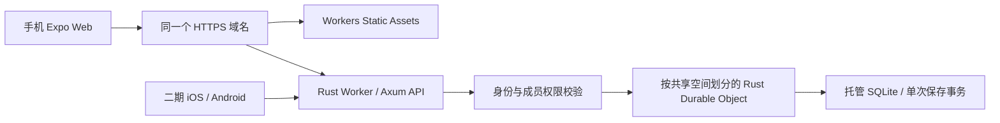

# Cloudflare 免费部署调研

核验日期：2026-10-09（北京时间）。本次查阅当前官方文档、已发布 Rust SDK 和官方示例，并用本地 Workers 运行时验证关键路径。后续已实现完整原型的本地／Worker 双入口与存储适配，见下节；尚未创建 Cloudflare 线上资源。

## 当前实现进展

按用户要求，原生 SQLite 与 Cloudflare Durable Objects 通过配置选择；Rust 模型、业务、API 和 SQL 迁移共用一份。
完整原型已通过两种存储的同一套 API 合约：中途 SQL 失败全回滚、训练完成／归档、目标历史、困难／经验、并发幂等与版本冲突、重启保留数据。
Worker 入口也通过手机尺寸浏览器流程和部署预检查。配置和启动命令见 [双环境说明](runtime-storage.md)。
下文保留调研时的依据和独立探针结果；线上 CPU、实际手机网络、生产登录和正式数据迁移仍待部署验收。

## 1. 最新 Rust 支持：可以保留 Rust 和 Axum

**Cloudflare Workers 官方支持 Rust，也支持 Axum。** 不能把“当前本地服务需要适配”写成“Workers 不能运行 Rust”。

- 官方 [Rust 指南](https://developers.cloudflare.com/workers/languages/rust/)说明可以用 `workers-rs` 编写完整 Rust Worker，包括直接访问平台存储绑定。
- 本次 `cargo info` 查询到已发布的 `worker` / `worker-build` 均为 **0.8.7**，最低 Rust 版本 1.91；项目当前 Rust 1.99 满足要求。
- 官方 [Axum 示例](https://github.com/cloudflare/workers-rs/tree/b171cb4bdd6fa943bb81f429df0a6b0df37e14b3/examples/axum)采用 Axum 0.8，启用 `worker` 的 `http` / `axum` 特性，通过 `#[event(fetch)]` 调用 Router。无需把 API 改写成 JavaScript。
- 标准方式将 Rust 编译为 `wasm32-unknown-unknown`；`worker-build` 自动生成 JavaScript 接入代码，应用逻辑仍用 Rust。
- 当前官方 SDK 还提供实验性的 `--emscripten`、`experimental_tokio` 和 TCP 示例。不能继续笼统声称 Workers 不支持 Tokio 或文件 API。[当前 README](https://github.com/cloudflare/workers-rs/blob/b171cb4bdd6fa943bb81f429df0a6b0df37e14b3/README.md#emscripten)明确称该路径为 experimental，并说明示例中的文件系统是内存文件系统。

对于本项目，优先采用已通过本地验证的 Rust + Axum Fetch 入口。实验性兼容路径暂不作为一期依赖。它也没有消除持久化需求：内存里的 SQLite 文件不能替代现在的持久数据库。

### 当前代码需要适配的地方

| 当前实现 | Workers 适配 |
| --- | --- |
| `main.rs` 的 `#[tokio::main]`、loopback TCP 服务启动 | 使用 Worker Fetch 入口，调用 Axum Router |
| `lib.rs` 的 Axum 路由、JSON 类型、请求校验 | 保留设计，替换注入的存储状态及平台相关调用 |
| `Database` 的 `spawn_blocking` + `Mutex<rusqlite::Connection>` | 改为 Durable Object / D1 存储适配 |
| `store.rs` 的本地 rusqlite 事务 | 保留业务语义，使用平台事务 API；SQL 及错误映射需重新验证 |
| `ServeDir` / `ServeFile` 读取 Expo 导出文件 | 使用 Workers Static Assets 托管 `apps/client/dist` |
| `model.rs` 的业务模型、训练和目标规则 | 尽量共享；UUID、日期等依赖逐项检查 Wasm 兼容性 |

因此，Rust 后端可以部署到 Workers；当前服务还需要入口和存储适配，不能把本地可执行文件原样上传当作完整迁移。

## 2. 推荐：一个站点，Rust API + SQLite-backed Durable Objects

初期一个家庭共享空间可以对应一个对象，把训练、目标、困难、经验、操作幂等表和版本历史放在同一个事务边界内。对象 ID 必须由服务端依据已授权的共享空间决定，不能直接信任客户端传入的空间标识。

推荐该方案的原因是现有保存流程需要“读取状态 → 验证版本 → 多表写入 → 一起提交或回滚”，SQLite-backed Durable Objects 的存储事务与此相近。Rust SDK 已提供 `Storage::transaction` 和 `SqlStorage`，本次也验证了二者一起工作。对象内的数据是权威来源，一期不增加 D1 镜像数据库。

Durable Object 并不是自动解决所有并发问题的锁：仍需在同一事务内校验版本、保存幂等结果；不能把读写拆散在事务外，不能在事务中加入不必要的外部网络等待。按空间划分对象后，跨空间搜索、统计和导出需要额外实现；这是与 D1 集中式 SQL 的主要取舍。

### D1 也是可行备选

Rust SDK 支持 D1。D1 的 `batch()` 按顺序执行 SQL，某个语句失败会回滚整个批次，但现有交互式 rusqlite 事务不能机械替换为批次。

本次本地复现：`UPDATE ... WHERE version = expected` 更新零行时，后续插入仍然提交。版本冲突必须在同一个数据库事务内转化为失败，例如经过验证的约束或触发器保护；提前读版本再发批次会留下竞争窗口。约束失败触发整批回滚也已验证，但未完成完整业务的 D1 移植。

如果后续确实需要大量跨空间 SQL 查询，可以重新评估 D1。当前小规模协作和一致保存需求更适合先使用一个对象内的事务。

## 3. 当前官方免费额度

额度按账号/产品适用范围计算，不是每个家庭都有一份；以下数字核验于本次日期，不承诺长期不变。

| 服务 | 当前免费额度 | 对本项目的影响 |
| --- | --- | --- |
| Workers 动态请求 | 100,000 次/日；每次 CPU 10 ms；128 MB isolate 内存 | Rust 同样适用；数据库/网络等待不计 CPU，JSON 和权限校验计入 CPU |
| Workers Static Assets | 静态请求免费且不限次数；Free 最多 20,000 文件，单文件 25 MiB | Expo 静态导出可以托管，避免每个静态请求都调用 API Worker |
| SQLite-backed Durable Objects 请求 | 100,000 次/日 | 网关 Worker 和对象请求分别消耗各自额度 |
| Durable Objects 运行时长 | 13,000 GB-s/日 | 有活动或不具备休眠条件的驻留时间会计量；一期普通 HTTP 请求，不保持常驻后台循环 |
| Durable Objects SQL 存储 | 每日读取 500 万行、写入 10 万行；账号合计 5 GB | SQL 索引写入也消耗行额度；对象单体上限 10 GB，但 Free 账号总量先受 5 GB 限制 |
| D1（备选） | 每日读取 500 万行、写入 10 万行；账号合计 5 GB | Free 单库最大 500 MB，最多 10 库；每次 Free Worker 调用最多 50 个 D1 查询 |
| R2 Standard（后续附件） | 每月 10 GB-month、100 万 Class A、1,000 万 Class B；出站流量免费 | 需开通 R2 订阅/结账流程，超额可产生费用；一期文字记录先不启用 |
| Pages（前端备选） | Free 500 次构建/月 | 可托管 Expo；Pages Functions 消耗 Workers 额度。当前更建议 Static Assets 与 API 同域 |
| Containers | 没有 Free 运行额度，需 Workers Paid，最低 $5/月 | 可评估普通 Rust 容器，但不属于本次纯免费路线 |

普通 Free Worker 的 CPU 上限为 10 ms；[Durable Objects 专属限制](https://developers.cloudflare.com/durable-objects/platform/limits/)当前列出默认每请求 30 秒 CPU。不能把这两个入口的限制混用。网关保持轻量，真实线上日志仍需测量，不能用本地耗时推断一定满足免费 CPU 限制。

Workers / D1 / Durable Objects 的每日免费额度于 UTC 00:00 重置，即北京时间 **08:00**。Free 超额会出现请求/操作失败，不能假定自动升级或继续可用。R2 的按量订阅需要单独考虑账单。

粗略用量示例：假设 10 名成员每天各发 50 次动态请求，则为 500 次/日，约占 Worker 请求额度 0.5%。这只是规划假设；读取行数取决于扫描范围，写入还包含索引，当前一次读取全量状态的实现需改为分页和按需读取，不能据成员数量直接推断数据库用量。

可以先使用平台提供的 HTTPS `workers.dev` 地址，免买域名。自有域名注册费另计；是否适合国内手机访问需要实际网络测试。

## 4. 本次实际验证结果

验证使用独立的探针项目，仅含合成数据，未接入腾讯数据，也没有部署到 Cloudflare 账号。

| 项目 | 结果与边界 |
| --- | --- |
| 发布版查询 | `cargo info worker` / `worker-build` 均返回 0.8.7；官方仓库 HEAD 为 `b171cb4bdd6fa943bb81f429df0a6b0df37e14b3` |
| Rust + Axum Wasm 构建 | `cargo build --target wasm32-unknown-unknown --release` 和 `worker-build --release` 成功 |
| 本地 Worker HTTP | Wrangler 4.149.0、workerd 1.20261006.1；`/api/health` 返回 200 和 Rust / Axum 0.8 JSON |
| Rust DO SQL 失败事务 | 同一 `Storage::transaction` 中写入两行后返回错误；接口 409，后续查询行数 0 |
| Rust DO SQL 成功事务 | 两行一起提交；后续查询行数 2 |
| Wrangler 部署预检查 | `deploy --dry-run` 通过；探针上传体积 509.29 KiB，gzip 148.85 KiB；没有远端部署 |
| D1 版本冲突批次 | Miniflare 4.20260730.0 / workerd 1.20260730.1；零行条件更新不阻止后续插入，批次内约束错误可回滚全部写入 |

当前 [Workers 限制](https://developers.cloudflare.com/workers/platform/limits/)列出的上传上限为 Free/Paid 均 **64 MiB 未压缩体积**。不能继续套用历史的 Free 3 MB 压缩限制。探针体积不等于完整业务构建体积。

可复现的 Rust 探针见 [tools/cloudflare-probe](../tools/cloudflare-probe/README.md)。后续完整原型的并发、幂等与事务已经在两种本地运行环境验收；线上 CPU、国内手机访问和正式登录尚未在 Cloudflare 部署环境验证。

## 5. 实施顺序

1. 提取可共享的 Rust 模型和业务规则，保留本地 API 开发入口；新增 Worker Fetch/Axum 入口及 SQLite-backed DO 存储适配。普通文件服务改为 Static Assets。
2. 迁移并验证所有保存事务：训练和目标快照、多目标角色、归档和历史、困难/经验分支、幂等回放、冲突、失败回滚。DO 初始化使用 `new_sqlite_classes` 迁移，版本迁移可重复执行。
3. 配置同源 `/api/*` 与静态页面路由。若启用 SPA 回退，使用 `assets.run_worker_first = ["/api", "/api/*"]`，确保直接浏览 API 和未知 API 仍由 API 处理，避免返回 `index.html`。
4. 补齐身份、空间成员权限与测试。Web 登录和原生 App 登录一起考虑；第二期不能仅依赖浏览器登录 Cookie。演示可继续只使用样例数据，真实记录上线需有权限隔离。
5. 实现按空间导出和独立恢复验收、记录分页与索引；按实际扫描/写入行数及存储大小观察额度。
6. 在 Cloudflare 测试环境部署合成数据，用线上日志确认普通 Worker CPU；用国内实际手机 Wi-Fi/蜂窝网验收 HTTPS、登录、保存、刷新、重试和多人冲突，之后再导入真实数据。

暂不启用 R2、语音、游戏及原生构建服务，以当前文字记录闭环为上线范围。Expo Web 静态部署本身不需要 Expo EAS 付费；未来原生 App 发布费用不属于 Cloudflare 免费额度。

### 仅为先看手机原型的另一条路线

[Cloudflare Tunnel](https://developers.cloudflare.com/tunnel/get-started/)可以把常开电脑上的现有 Rust + SQLite 服务暴露为 HTTPS，减少业务迁移。但计算和磁盘仍在该电脑上，电脑停机即不可用，并非 Cloudflare 免费云托管。具名 Tunnel 的当前指南要求账号、由 Cloudflare 管理的域名及运行 `cloudflared` 的主机。

正式免费托管推荐 Workers 方案；Tunnel 适合短期验证现有原型。普通容器/VPS仍是保留现有运行方式的备选，其费用另算。

Cloudflare 免费全球网络不包含大陆节点；[China Network](https://developers.cloudflare.com/china-network/)需要 Enterprise 和额外订阅。更换自有域名不能据此承诺国内访问稳定，这一项需用户手机网络实测。

## 6. 官方来源

- [Rust 支持及部署指南](https://developers.cloudflare.com/workers/languages/rust/)
- [workers-rs 0.8.7](https://docs.rs/worker/0.8.7/worker/) / [worker-build 0.8.7](https://docs.rs/crate/worker-build/0.8.7)
- [官方 Axum 示例及当前源码快照](https://github.com/cloudflare/workers-rs/tree/b171cb4bdd6fa943bb81f429df0a6b0df37e14b3/examples/axum)
- [Workers 定价](https://developers.cloudflare.com/workers/platform/pricing/) / [限制](https://developers.cloudflare.com/workers/platform/limits/)
- [Static Assets 定价](https://developers.cloudflare.com/workers/static-assets/billing-and-limitations/) / [SPA 路由](https://developers.cloudflare.com/workers/static-assets/routing/single-page-application/)
- [Durable Objects 定价](https://developers.cloudflare.com/durable-objects/platform/pricing/) / [限制](https://developers.cloudflare.com/durable-objects/platform/limits/) / [SQLite 事务 API](https://developers.cloudflare.com/durable-objects/api/sqlite-storage-api/)
- [D1 定价](https://developers.cloudflare.com/d1/platform/pricing/) / [限制](https://developers.cloudflare.com/d1/platform/limits/) / [batch API](https://developers.cloudflare.com/d1/worker-api/d1-database/)
- [R2 定价](https://developers.cloudflare.com/r2/pricing/) / [开通流程](https://developers.cloudflare.com/r2/get-started/)
- [Pages 限制](https://developers.cloudflare.com/pages/platform/limits/) / [Containers 定价](https://developers.cloudflare.com/containers/platform/pricing/)
