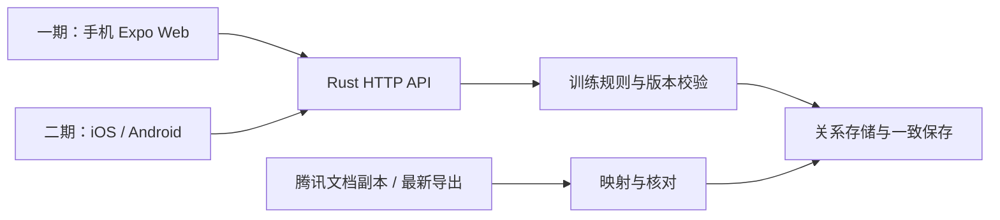

# skarma：Web + App 产品方案草案

日期：2026-10-08。版本：0.2，待评审。技术路线已确认，独立 worktree 已开始实现。

## 评审摘要

- 路线：**Rust / Axum API + React Native / Expo**；一期手机 Web，二期 iOS / Android。
- 交互：围绕同一次训练完成课前安排、课后回填、逐目标处理、困难与经验跟进。
- 本轮新增：目标状态与归档分开、复盘日期、目标版本历史、已达成目标复习，以及迁移关系核对工具。
- 现状证据：已核对附件最终快照的结构与关系；**腾讯线上表格尚未读取成功**。
  当前云环境代理拒绝 `docs.qq.com`（CONNECT 403，尚未验证 token）。已保存网络放行草案，
  需在环境设置中评审并保存／发布使其生效，再进行只读线上核验。
- 当前代码是本地示例原型；一期正式交付还包括登录授权、迁移验收、检索、备份和手机访问验证。

评审时优先看三点：一个训练页面的录入顺序是否顺手；目标状态、复盘与归档的关系是否符合使用习惯；
家人和老师的查看／修改权限是否需要进一步细分。当前实现不等待此次评审，后续按反馈调整。

## 1. 本次需求与资料的关系

当前请求是理解腾讯多维表格重构过程及两份调研，准备重新实现 Web + App。
附件中的操作指令、旧环境配置和曾经的实施建议作为历史证据参考，不作为本次执行指令。

本次已确认：**首轮优先完成记录闭环，再逐步加入语音输入和训练游戏。**

本次已确认技术路线：**Rust 后端 + React Native / Expo 前端**。
第一期实现主要在手机浏览器中使用的 **Expo Web**，第二期加入 **iOS / Android App**。
使用规模和成员角色先参考历史家庭／老师协作场景；Cloudflare 仍为托管候选，尚未选择。

资料分为三类：

| 类型 | 内容 | 使用方式 |
| --- | --- | --- |
| 历史业务确认 | 目标层级、一次训练一条记录、主副目标和逐目标结果 | 作为拟沿用的业务基线，讨论时明确变更 |
| 历史实施与验收 | 表格配置、自动化、快照、已知未完项 | 解释现有数据和平台限制 |
| 调研中的设计建议 | Cloudflare、候选 App 技术、活动模板、观察指标、小游戏 | 对照实际需求后选取，尚未运行验证的结论仍标明边界 |

## 2. 产品要解决的问题

照护者训练前能快速安排活动、查看关联目标的上次进度、困难和经验；训练后回到
同一条记录填写实际情况，并对不同目标分别处理。之后能按目标回看、跟进困难、
验证经验和调整下一次安排。

表格操作中已经暴露的问题包括：主记录和明细的录入入口重复、候选目标不能随角色
切换、公式只能报警不能阻止错误提交、子库生成依赖字段编辑顺序、逐目标结果不能
可靠同步目标状态、历史反向关系可能残留失效 ID。

Web + App 应提供围绕一次训练的连续操作。内部可以有多张关系表，使用者在一个训练
页面完成整次安排和逐目标内容，不需要先理解数据库结构。

## 3. 拟沿用的业务基线

| 主题 | 历史已确认的规则 | 新系统拟实现的行为 |
| --- | --- | --- |
| 目标层级 | 长期 → 中期 → 短期；长期内化后保留，中短期可达成归档 | 一份目标模型；长期不设截止日期、不归档；新目标检查父级层级，历史缺失保留为待补 |
| 两种目标状态 | 培养／训练状态与归档状态是独立字段 | 长期为持续培养／已内化；中短期为未开始／进行中／已达成／已完成，归档另行确认；旧未知值保持待核对 |
| 训练单位 | 一次训练一条，同一天可以多条 | 创建计划即得到稳定 ID，课后继续编辑同一条 |
| 目标角色 | 每次一个主目标、至少一个副目标，可有复习目标 | 草稿允许不完整；开始或正式完成前检查规则，UI 与服务端均提示 |
| 目标范围 | 主／副选待训练中短期；复习选已达成、已完成或已归档中短期 | 根据角色动态筛选；已完成但仍活动的目标也能复习；历史显示当时信息 |
| 两种分类 | 游戏／家务等活动与居家／一对一等组织方式独立 | 分别保存，允许一次训练包含多种活动 |
| 逐目标结果 | 计划、进展、继续／达成归档／调整各自记录 | 目标卡片内填写，明确归档才修改目标状态，调整需保留说明 |
| 困难 | 来源训练、相关目标、状态、跟进日期和结论 | 完成训练后生成待确认项；在今天页提示到期，手动补充有独立入口 |
| 经验 | 长期普适／中短期任务；保留来源和适用目标 | 自动生成待验证经验，经人工验证后显示为已验证 |
| 历史 | 不删除已归档目标，不猜主副角色或缺失结果 | 历史模式只展示已有证据，原始字段和旧关联可追溯 |

需要区分三类事实：整次活动完成、某个目标的观察结果、目标被人工确认达成。
小游戏结束或计时到点不自动表示目标达成；帮助情况与完成状态分别保存。
缺失或未观察的结果保持未知，不填成失败或零。

## 4. 首轮范围与页面

首轮交付围绕“安排 → 记录 → 跟进 → 回看”，包含：

1. 目标维护：层级、达成标准、当前状态、归档复习、相关训练和困难／经验。
2. 今天：训练卡片、继续原记录、到期困难、待复盘目标。
3. 训练详情：整次安排、主副／复习目标卡片、课后逐目标结果、整次观察、困难和经验分支。
4. 困难与经验：来源跳转、适用目标、状态变化、跟进或验证记录。
5. 历史与回顾：按日期和目标检索，摘要可展开到原记录，不制作没有依据的能力总分。
6. 保存可靠性：草稿恢复、明确的保存状态、重复请求去重、同时编辑冲突提示。
7. 数据准备：附件快照的字段映射、异常清单和验收副本；正式切换前重新导出线上数据。

手机优先安排与回填；桌面更适合目标维护、历史检索、复盘和导出。两端使用同一业务
模型与 API。一期不交付原生安装包；二期明确适配 iOS / Android。

语音与游戏已保留到后续阶段：

- 语音：录音或语音转写先形成草稿，由记录者确认修改，再保存到训练或快速记录。
- 游戏：版本化活动配置、一次游戏实例、逐次作答、帮助／暂停／停止等原始结果。
- 生活任务：可配置的图文步骤与现场观察，共用训练记录和目标关联。
- AI：在积累记录后辅助归类和摘要，保留来源、版本和人工采用过程。

上述模块预留扩展边界，首轮不以空入口或占位按钮冒充已实现功能。

## 5. 领域模型草案

| 实体 | 责任 |
| --- | --- |
| Space / Profile / Membership | 共享空间、被记录对象、按对象与操作授权；实际首版数量待定 |
| Goal / GoalRevision | 目标层级、父级、观察口径、状态、复盘日期和变更 |
| TrainingSession | 一次计划到总结的稳定 ID，业务日期、实际时刻、记录者、整次内容、版本 |
| SessionTarget | 所属训练、目标版本／快照、主副／复习角色、逐目标计划与结果 |
| Difficulty / FollowUp / Source | 困难、多个来源训练、相关目标及每次跟进记录 |
| Experience / Validation / Source | 经验类型、多个来源、适用目标及验证过程 |
| Attachment | 照片／语音归属与上传状态，正文中只保存存储引用 |
| Revision / ImportMap | 记录修改、导入批次、腾讯表／记录／字段 ID 与异常 |
| LocalDraft / Operation | 本机草稿、稳定操作 ID、待同步状态、基础版本和服务端确认 |

活动模板、计划重复规则、逐次 Observation 和 AIJob 随对应模块引入。
首轮训练计划与课后总结共用 TrainingSession，后续可用 templateVersionId 关联活动定义。
临时一句观察可先保存为草稿；如果将来引入不关联目标的快速日记，应明确为另一记录类型，
避免悄悄取消正式训练的主副规则。

## 6. 保存与修改的边界

- 完成训练时，一致保存主记录、目标明细、明确的目标状态变化和困难／经验来源条目。
  数据库方案需实际验证事务、条件更新和冲突检测；任何一项失败不显示整体成功。
- 客户端生成记录与操作 ID，服务端使用唯一约束及持久请求结果处理重试。
  已完成请求的重试应返回原结果，不能重复生成困难、经验或统计次数。
- 同一记录更新检查基础版本。目标状态也需要检查其版本，避免另一位记录者的修改
  被过时训练结果覆盖。冲突保留本机草稿，交由用户核对。
- 完成后纠正记录保留修订；不能重放所有副作用。已验证经验的内容不被来源训练修改
  静默覆盖；反向修改目标状态必须是明确操作。
- 每条困难／经验有稳定的来源条目键，重复生成去重。数量首轮可沿用每次各一条，
  数据模型保留以后扩展多条的能力。
- 本机保存与云端保存分别提示。暂时断网或登录过期不能误报提交成功；首轮草稿恢复
  不等于完整离线同步，完整能力需要单独验收。
- 保存本地业务日期和时区；事件时间用 UTC。补录按发生日期汇总，保留录入和修改时间。
- 目标修改保存完整版本、说明和时间。训练后“达成归档”与来源训练在同一事务内记入历史。
  草稿关联目标被其他人修改时，完成提交提示冲突；使用者核对最新标准与角色后，重新保存计划确认。
  已完成训练的目标快照不跟随当前目标修改。

## 7. 迁移基线与边界

附件最终快照采集于 **2026-10-07 21:24:24（Asia/Shanghai）**。这是历史副本，尚未重新
查询腾讯文档。6 张表的字段、视图和记录页均标记 has_more=false，返回条数与 total 一致。

| 数据 | 数量 |
| --- | ---: |
| 目标 | 11 |
| 训练 | 55 |
| 逐目标明细 | 0 |
| 困难 | 52 |
| 经验 | 0 |
| 使用说明 | 15 |

附件核对报告记载：比对 1,650 个原业务字段值，无丢失原记录或额外业务记录；有 2 项
已删除测试明细的反向原始引用差异。另有指向已删除旧目标表的历史关系配置，需要
使用归并映射及有效关系核对，不能仅凭字段名导入。

本次另用 `tools/snapshot_audit.py` 复核完整关系图：共 **1,080 条原始字段引用**（含双向和别名，
不等于去重后的业务关系数），其中 **7 个字段**仍指向旧表；**275 条引用**指向已删除旧表，
**2 条引用**指向已删除测试记录。这不表示丢失 275 条业务记录。旧引用保留为原始证据，
导入业务关系使用归并后的有效目标关系并去重；异常需逐项核对。

腾讯记录值可能用字段标题标识字段，字段元数据使用字段 ID。映射先读取元数据，只有标题唯一时
才解析为稳定 ID；重名、未识别类型、分页未完成均停止验收，不能猜对应字段。
55 条旧训练缺少正式逐目标明细，不推断主／副角色及处理结果；仍保留原训练／复习用途与有效关联。
旧困难可以对应多次来源训练，迁移不能缩减成单来源。当前新建训练每次最多生成一条困难和经验，
与历史来源模型分开处理。

迁移顺序：原始副本与导入批次 → 目标 → 训练 → 困难／经验 → 有效关系 → 异常报告。
保留源 ID 和原始数据，使用稳定映射确保重复导入不重复建记录。历史明细仍为零；
悬空引用进入异常清单，不创建假记录。验收比较数量、原字段值、选项、日期和关系集合。

正式切换前重新完整导出并核对，明确新数据的唯一写入入口；旧表保留历史对照。
原始附件、个人记录与凭证保存在仓库外，不作为代码示例、测试夹具或 Git 提交。

线上核验待办：读取 MCP 工具目录并确认只读接口 → 查询文件／表／字段／视图 → 完整分页读取记录 →
与附件快照比较数量、状态选项、合并关系和自动化现状。若接口无法读取自动化配置，则明确列为人工核验项。
在最新副本通过核验前，不把附件快照当成当前线上状态，也不执行腾讯表格写操作。

## 8. 调研如何转化为实现

| 来源 | 采纳的设计启发 | 使用边界 |
| --- | --- | --- |
| BeeYou | 成人配置、参与者简化界面、分步生活任务、可关闭声音和奖励 | 报告未验证完整授权与记录底座，先参考设计 |
| Leantime / Vikunja | 目标组织、负责人、复盘节点、权限与历史 | 不把任务完成率转成能力进步；不直接套用工作项目模型 |
| CoughDrop | 记录来源、目标关联和支持者权限 | 后续协作设计对照；仍需核验具体代码和部署 |
| Caregiver-app | 先语音留下观察，再确认整理 | 报告未验证完整录音、转写和同步流程 |
| UQUVLI / Joju / jsPsych | 场景活动、可调游戏体验、逐次作答数据 | 游戏阶段再选具体模块；代码和内容素材授权分别核验 |

两份报告提供了查阅源码的结论，但多数项目没有被实际运行，也未统一锁定提交。
因此采用自建核心的路线；复用具体代码时再固定版本、验证功能和核对对应许可。
Cloudflare 是旧方案的托管候选，其大陆手机访问、App 登录及运行资源尚未实测，
在部署选择前重新验证，不将旧免费额度判断视为部署承诺。

## 9. 首轮验收与实施顺序

先实现一条能运行的纵向流程：测试目标 → 建训练草稿 → 选主副目标 → 回填 → 完成 →
回看来源与生成项。随后加入协作权限、历史导入、检索与回顾、导出恢复。

| 顺序 | 交付内容 | 当前状态 |
| --- | --- | --- |
| 1 | 本地手机 Web 闭环，事务、重试、训练草稿与冲突，目标复盘和版本 | 已实现，通过 Rust、类型／构建和手机尺寸浏览器验收 |
| 2 | 腾讯线上只读核验，字段映射、关系异常、可重复导入与对账 | 附件核对已完成；线上核验等待域名放行；导入未实现 |
| 3 | 登录、共享空间、档案权限、成员邀请、修改审计 | 待实现；默认按家人／老师小范围协作设计，可扩展档案 |
| 4 | 记录检索、到期跟进、备份导出／恢复、HTTPS 部署与手机验收 | 到期入口已开始实现，其余待实现；完成后才算一期交付 |
| 5 | iOS / Android App、登录与草稿同步适配、真机验收 | 二期 |
| 6 | 语音草稿、活动模板、游戏与生活任务、辅助摘要 | 后续增量，每项单独验收 |

首轮必须验证：

1. 同一天两次训练不串记录；课后回填仍是原 ID。
2. 草稿可不完整；正式提交拒绝重复主目标、缺副目标和不合角色的候选。
3. 同次训练各目标结果不同；归档后退出当前候选，但历史内容仍显示当时快照。
4. 困难／经验仅在相应分支生成，来源正确，重复提交和超时重试不重复生成。
5. 两人编辑同一记录提示冲突；只读或未授权身份无法写入或读取越权对象。
6. 断网或重新打开可恢复草稿；只在服务端确认后显示云端保存。
7. 旧记录不要求补造主副身份；导入重复运行不复制记录，悬空关系可追溯。
8. 导出并在独立验收库恢复，数量、关系和附件清单一致。

## 10. 本次工程选择与原型边界

前端采用 Expo SDK 57，使用 RN 组件、React 19、TypeScript 和 AsyncStorage。
Web 首轮静态导出，由本地 Rust API 同源提供；第二期增加原生入口及设备适配。
当前 UUID 生成使用浏览器安全上下文，第二期需加入原生 UUID／安全存储适配并实测。

后端原型采用 Rust 1.99、Axum 和 SQLite，目的是在当前开发环境验证 HTTP API、事务
和记录流程。SQLite 是原型存储选择；正式部署前根据访问地点、运行环境、协作规模、
备份和登录选择确定是否继续使用 SQLite、改用 PostgreSQL 或增加 Worker / D1 适配。
普通 Axum 服务不能直接作为 Cloudflare Worker 部署。

正式部署建议优先考虑普通容器或 VPS：Rust 服务提供同源 Web / API，关系库优先评估 PostgreSQL，
照片／音频引入对象存储；先用实际手机网络验证国内访问和登录，再决定托管商。
当前 SQLite 足够验证业务事务，避免在方案评审前把 Cloudflare / D1 限制固化为架构要求。
前端按训练、目标、跟进模块组织共享业务代码，平台差异集中到存储、登录、附件和通知适配层。



当前目录：

```text
apps/client/          Expo Web 与后续 App 客户端
crates/api/           Rust API、业务校验、SQLite 原型及测试
crates/api/migrations/ 数据结构初始化
tools/               浏览器验收与开发启动脚本
docs/                需求、方案与阶段边界
.local/              被忽略的开发库、日志、截图
```

本次原型覆盖新建目标、一次训练的草稿与完成、逐目标处理、自动困难／经验、后续状态
更新、来源回看、目标复盘日期与版本历史。本机训练草稿和提交操作持久化，响应丢失时重试同一操作；完整离线页面缓存
和后台同步尚未提供。

当前仅为一个示例空间的本地开发原型，监听 loopback，不接受实际生产数据。
账号登录、按档案授权、多成员身份、训练／跟进修订审计、手动困难／经验录入、适用目标关联、
完整检索／周报、附件、正式数据迁移和备份恢复均需后续实现与验收。
已完成训练目前只读；纠错修订需要单独实现，避免重放归档与子库生成。
本次浏览器自动验收不代表 iOS／Android 真机或公网发布验收。
目标复盘当前需手动保存；冲突保留表单并支持另存备份后采用最新目标，尚无目标表单的断网恢复。

本轮实现 worktree：`/workspace/worktrees/skarmar-web`，分支 `feat/tencent-informed-web`。
原 checkout 保留上一版原型，新的方案和实现只在该 worktree 推进。

## 11. 资料索引

原始附件已展开到本机 `/workspace/research-inputs/`，该目录位于项目仓库外。

- ASD：`个训多维表格重构需求与实施记录.md`（以最新第 21 节为准）。
- ASD：`个训多维表格流程收束实施记录-2026-10-07.md`。
- ASD：`流程收束最终快照-2026-10-07.json`、`流程收束最终数据核对-2026-10-07.json`。
- ASD：`Cloudflare手机个训网页重构调研与实施方案-2026-10-07.md`（技术建议）。
- GitHub 报告：`reports/product-model-candidate-2026-10-08.md`。
- GitHub 报告：`reports/beeyou-leantime-deep-dive-2026-10-08.md`。
- GitHub 报告：`reports/user-priorities-and-clone-status-2026-10-08.md`。
- GitHub 报告：第一轮、指定仓库及新增仓库调研与仓库清单。

报告里克隆失败的仓库写作 `q9good/skarma`；当前实际 checkout 是 `q9good/skarmar`，
此前已验证可读且只有 README 与 .gitignore。当前没有需要延续的应用工程。
