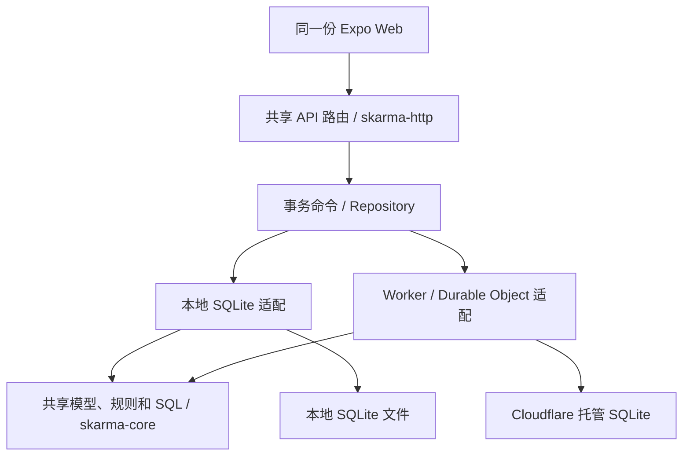

# 本地与 Cloudflare 双运行环境

日期：2026-10-09。两种入口已实现并在本机验收，Cloudflare 线上部署尚未执行。

## 架构与配置

同一套 Rust 模型、业务规则、SQL 迁移和 `/api` 路由，接两个存储适配层：

| 入口 | 配置 | 持久存储 |
| --- | --- | --- |
| 普通 Rust / Axum 服务 | `SKARMA_STORAGE=sqlite` | `SKARMA_DATABASE` 指定的 SQLite 文件 |
| Cloudflare Worker | `SKARMA_STORAGE=durable_object` | `SKARMA_DB` 绑定中的 SQLite-backed Durable Object |



配置决定存储实现，构建目标决定可用的运行入口：普通 Rust 程序和 Worker Wasm 是两个产物。
电脑上既可以运行原生入口，也可以用 `wrangler dev --local` 运行 Worker 入口，开发时不需要 Cloudflare 账号。
本地原生程序配置 `durable_object`、Worker 配置 `sqlite` 或填写未知类型时会明确报错，不会悄悄切换到另一个空库。

两种存储有相同的数据模型和业务语义；**切换配置不等于数据同步或搬迁**。本地 SQLite 文件和 Cloudflare 对象各自保存数据。本机 Wrangler 的模拟对象存储也独立于线上对象，正式迁移需要导出／导入与核对功能。

| 配置项 | 用途与默认值 |
| --- | --- |
| `SKARMA_STORAGE` | 原生默认 `sqlite`，Worker 默认 `durable_object`；启动脚本和 Wrangler 配置也显式指定 |
| `SKARMA_DATABASE` | 仅原生入口；程序默认 `.local/skarma.db`，示例启动脚本默认 `.local/demo.db` |
| `SKARMA_SPACE` | 仅 Worker 的对象选择；基础配置 `default`，示例环境 `demo`；由服务端配置，客户端不能任意指定 |
| `SKARMA_DEMO` | `0` 不生成样例，`1` 在没有目标时生成样例；应用默认 `0`，两种示例启动命令显式用 `1` |
| `SKARMA_PORT` | 原生入口默认 3001；只绑定 loopback |
| `SKARMA_WEB_ASSETS` | 原生静态资源路径，默认 `apps/client/dist`；Worker 从 Wrangler 的 `assets.directory` 读取 |
| `SKARMA_WEB_ORIGIN` | 原生开发时允许的 Web 源，默认 `http://localhost:8081`；静态导出同源访问无需改变前端 API 地址 |

原生入口读取进程环境变量；Worker 从 `wrangler.toml` 的 `[vars]` / 对应环境的 vars 读取。原生程序不会自动加载 `.env` 文件。

## 启动

普通开发机需要 Rust 1.99、Node 24。在仓库根目录准备：

```bash
npm ci
npm run web:build
```

运行原生 SQLite 示例：

```bash
SKARMA_STORAGE=sqlite bash tools/start-local.sh
```

使用指定文件且不生成样例：

```bash
SKARMA_STORAGE=sqlite SKARMA_DATABASE=.local/my-records.db SKARMA_DEMO=0 bash tools/start-local.sh
```

第一次运行 Worker 入口需要准备构建工具：

```bash
rustup target add wasm32-unknown-unknown
cargo install worker-build --version 0.8.7 --locked
```

运行 Cloudflare 示例入口的本机模拟：

```bash
npm run cf:dev
```

等价于 `wrangler dev --env demo --local`。默认端口 8787；可以与原生入口同时运行。工具自动构建 Rust Worker，Static Assets 同源提供 Expo Web，`/api` 和 `/api/*` 始终进入 API，不受 SPA 回退影响。
Wrangler 默认将模拟对象持久化在被 Git 忽略的 `.wrangler/state`。指定独立测试存储和端口：

```bash
npm run cf:dev -- --port 8788 --persist-to .local/cf-test
```

使用没有示例数据的基础配置，在准备好工具后执行 `npx --no-install wrangler dev --local`。

受限云环境可运行 `bash tools/install-cloud.sh`，它安装固定 Worker 构建工具、Wasm target、npm 依赖并构建两个入口；`start-cloudflare.sh` 会激活可写目录中的工具与缓存。

## 事务与迁移

共享业务代码仅执行参数化 SQL，不创建文件、监听端口或调用平台存储 API。存储适配层负责为整个命令提供事务：

- 原生入口使用 SQLite `IMMEDIATE` 事务，在读取版本之前获得写入预约；单进程内通过 Mutex 调度连接。
- Worker 网关把同一个命令交给服务端配置的对象，在 `Storage::transaction` 内执行共享业务。业务失败必须拒绝事务回调，不能把错误 JSON 当作成功提交。
- 训练记录、目标角色关系、归档、历史、困难、经验、操作幂等响应一起提交／回滚；版本校验和幂等检查都在事务内。
- 两边的 SQL 文件统一位于 `crates/core/migrations`，`schema_migrations` 记录已应用版本。原型旧库没有该表时可补建并记录现有两版结构，已有记录保留；更高版本的库会被拒绝。
- 原生入口在事务之外为连接启用外键；Cloudflare 的 SQLite-backed 对象存储本身强制外键检查。

当前 `SKARMA_SPACE` 是原型单空间配置。正式多成员授权和按档案访问仍待实现，不能把它当成权限系统。

## 验证

```bash
cargo test --workspace --locked
cargo clippy --workspace --all-targets --locked -- -D warnings
cargo clippy -p skarma-worker --target wasm32-unknown-unknown --locked -- -D warnings
cargo build -p skarma-api --locked
(cd crates/worker && worker-build --release)
npm run test:runtimes
npm run cf:check
```

`test:runtimes` 需要 Python 3 做原生测试库的 SQL 故障注入。它为每种入口创建独立临时存储，通过同一套 API 请求验证：层级目标和历史、训练草稿／完成、归档快照、困难／经验分支、并发幂等重试、操作 ID 冲突、版本冲突、跟进结论及重启后的数据保留。

测试在困难插入前注入 SQL 错误，确认之前写入的训练、目标归档和历史全部回滚，移除故障后原操作可以重试成功。Cloudflare 的故障注入只存在于测试的 Miniflare JavaScript 包装器，正式 Rust Worker 没有 SQL 管理端点或测试后门。临时存储在测试结束时删除。

本次 21 项 Rust 测试、双存储 API 合约与重启验收、原生和 Wasm Clippy、类型检查／Web 构建通过。Worker 入口还通过了手机尺寸浏览器工作流和直接导航 API 的 JSON 404 检查。
`cf:check` 只执行部署包预检查，不创建或更新 Cloudflare 线上资源。

当前仍是未完成生产登录的原型。Cloudflare 运行行为已在本机 workerd 验证；线上免费 CPU 用量、真正的手机网络访问、账户绑定与备份恢复还需部署阶段验收。参见 [部署调研](cloudflare-deployment-research.md)。
